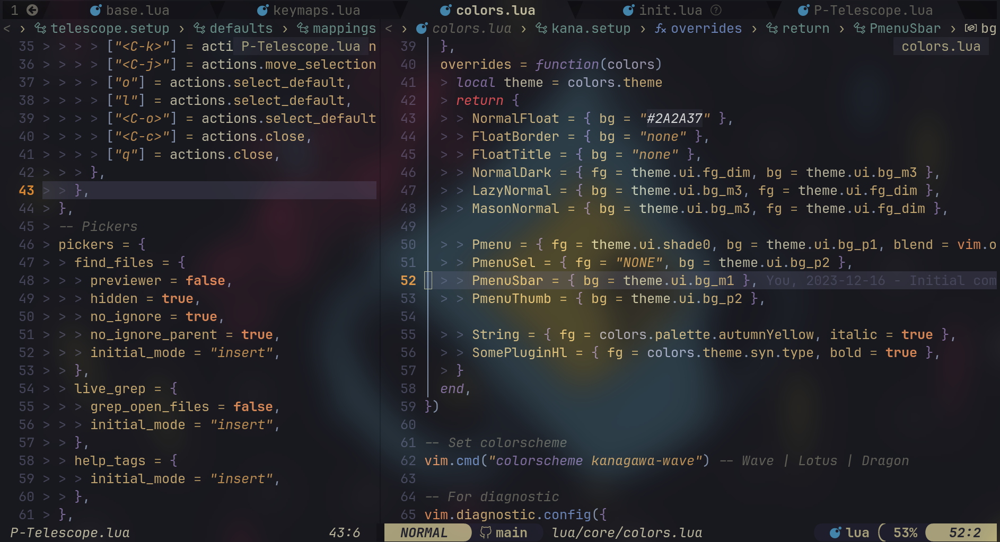

# MY NEOVIM CONFIGURATION

### SCREENSHOT



> DO NOT INSTALL IF YOU DON'T UNDERSTAND WHAT THIS TOOL IS USED FOR!

### REQUIREMENTS

1.  Neovim >= 0.9 - [https://github.com/neovim/neovim/blob/master/INSTALL.md](https://github.com/neovim/neovim/blob/master/INSTALL.md)
2.  Node.js - [https://nodejs.org/en](https://nodejs.org/en)
3.  Deno - [https://docs.deno.com/runtime/manual/getting_started/installation](https://docs.deno.com/runtime/manual/getting_started/installation)
4.  Yarn - [https://classic.yarnpkg.com/lang/en/docs/install/#debian-stable](https://classic.yarnpkg.com/lang/en/docs/install/#debian-stable)
5.  Ripgrep - [https://github.com/BurntSushi/ripgrep](https://github.com/BurntSushi/ripgrep)
6.  Git - [https://git-scm.com/download/linux](https://git-scm.com/download/linux)

### 🔌 PLUGINS

1. 💤 Plugin Manager: Lazy.nvim - [folke/lazy.nvim](https://github.com/folke/lazy.nvim)
2. 🎨 Theme: Kanagawa - [rebelot/kanagawa.nvim](https://github.com/rebelot/kanagawa.nvim)
3. 😃 Icon: Devicons - [nvim-tree/nvim-web-devicons](https://github.com/nvim-tree/nvim-web-devicons)
4. 🔴 Syntax highlight: Treesitter - [nvim-treesitter/nvim-treesitter](https://github.com/nvim-treesitter/nvim-treesitter)
5. 🗃️File Explorer: Neotree - [nvim-neo-tree/neo-tree.nvim](https://github.com/pnvim-neo-tree/neo-tree.nvim)
6. 🔎 File search: Telescope - [nvim-telescope/telescope.nvim](https://github.com/nvim-telescope/telescope.nvim)
7. ✅ Auto completion and formatting:
   - Lspconfig - [neovim/nvim-lspconfig](https://github.com/neovim/nvim-lspconfig)
   - Nvim-cmp - [hrsh7th/nvim-cmp](https://github.com/hrsh7th/nvim-cmp)
   - Mason - [williamboman/mason.nvim](https://github.com/williamboman/mason.nvim)
   - None-ls - [nvimtools/none-ls.nvim](https://github.com/nvimtools/none-ls.nvim)
   - ...
8. Other useful plugins:
   - Highlight colors - [brenoprata10/nvim-highlight-colors](https://github.com/brenoprata10/nvim-highlight-colors)
   - Back to where exited - [ethanholz/nvim-lastplace](https://github.com/ethanholz/nvim-lastplace)
   - Quick comment - [numToStr/Comment.nvim](https://github.com/numToStr/Comment.nvim)
   - TODO - [folke/todo-comments.nvim](https://github.com/folke/todo-comments.nvim)
   - Vim UI - [MunifTanjim/nui.nvim](https://github.com/MunifTanjim/nui.nvim)
   - ...

### 📦 Installation (Linux/MacOS)

- Clone the starter

```
git clone https://github.com/ZongMua/NeoVim.git ~/.config/nvim
```

- Remove the `.git` folder

```
rm -rf ~/.config/nvim/.git
```

- Start Neovim!

```
nvim
```

#

Author: aZong 󰄛
